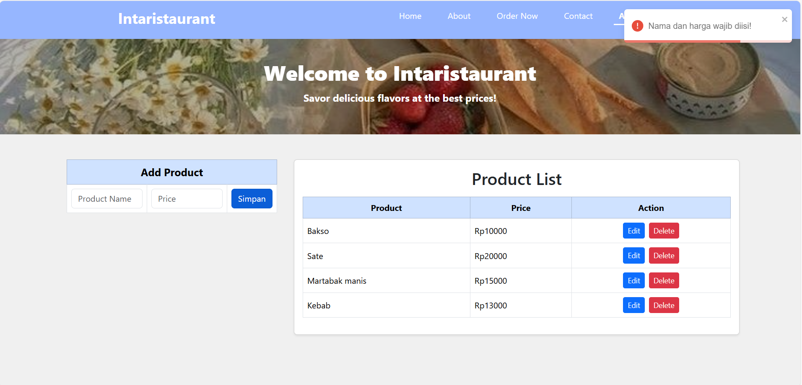
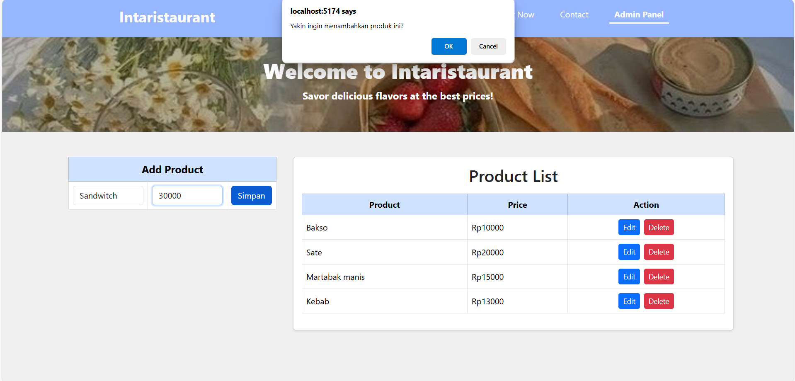
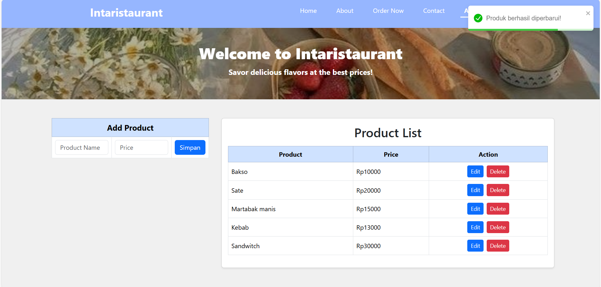
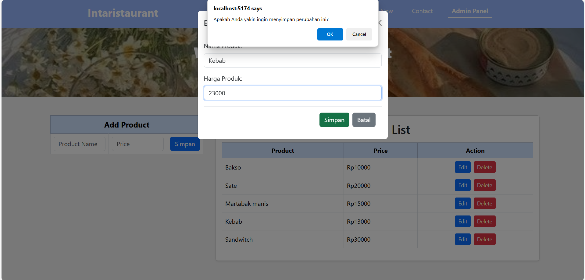
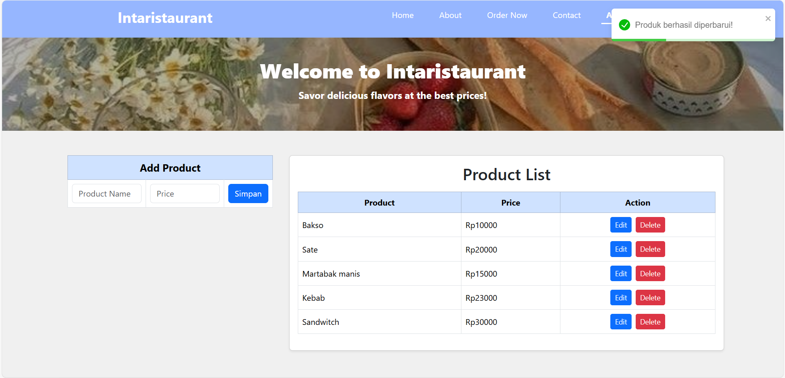
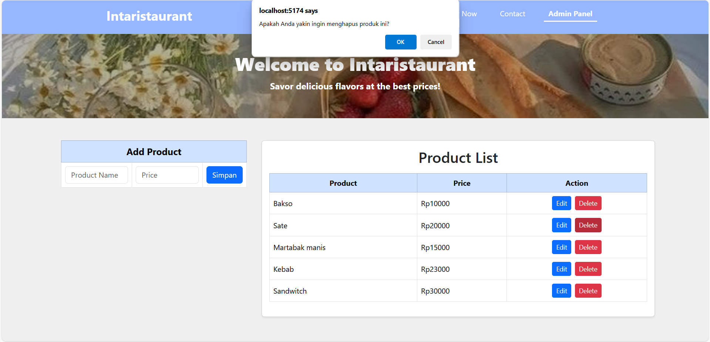
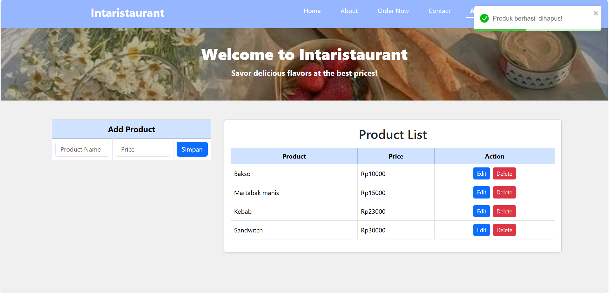
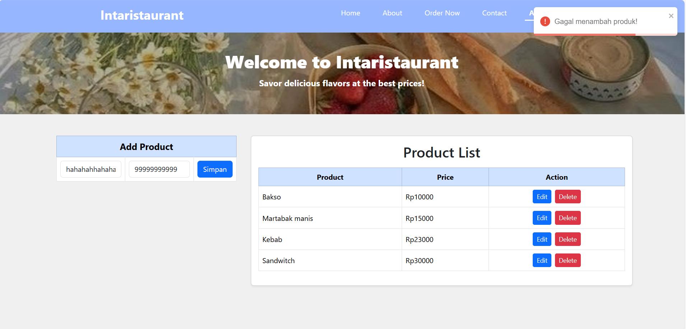

# 📌 EVALUASI DAN DOKUMENTASI

## 🛒 WEBSITE E-COMMERCE SEDERHANA

### 👥 Nama Anggota Kelompok:
- **Debora Intania Subekti** | 10231029
- **Riska Fadlun Khairiyah Purba** | 10231083

🔗 **Link Repository:** [GitHub - ecommerce](https://github.com/intniaaa20/ecommerce)

---

## 🔹 Pembagian Tim:
- **Debora Intania Subekti**: Backend ⚙️
- **Riska Fadlun Khairiyah Purba**: Frontend 🎨

## 📖 Deskripsi Proyek:
Website E-commerce sederhana bernama **“Intaristaurant”** adalah antarmuka dengan operasi CRUD (Create, Read, Update, Delete). Website ini memungkinkan pengguna untuk mengelola produk makanan, khususnya pada nama dan harga menu.

---

## 🛠️ Perangkat Lunak & Teknologi yang Digunakan:

### 🔹 Backend:
**Framework:**
- Express.js – Untuk membangun server dan API 🚀

**Database:**
- PostgreSQL – Penyimpanan data 🗄️
- pgAdmin – Alat GUI untuk mengelola database 📊

**Database Driver:**
- `pg` – Library Node.js untuk PostgreSQL 🔌

**Middleware:**
- CORS – Mengelola akses lintas domain 🔗
- JSON Parsing (`express.json()`) – Memproses body request dalam format JSON 📦

**Pengujian:**
- Postman – Untuk menguji API 🔍

**API Design:**
- Restful API – Untuk endpoint CRUD 📡

### 🔹 Frontend:
**Framework:**
- React – Framework utama UI ⚛️
- Vite – Bundler & development server ⚡

**State Management:**
- `useState` & `useEffect` – Mengelola state dan efek samping 🔄

**HTTP Request:**
- Fetch API – Mengambil data dari backend 🌐

**Styling:**
- CSS – Desain antarmuka 🎨
- Bootstrap – Elemen desain ✨

### 🔹 Perangkat Lunak Pendukung:
- GitHub – Manajemen repository kode 📂
- Git – Manajemen kode, push & pull 🔄
- Node.js – Runtime JavaScript untuk backend 🖥️
- npm – Package manager 📦

---

## 📂 Struktur Proyek:
```plaintext
ecommerce/
├── backend/
│   ├── index.js
│   ├── db.js
│   ├── package.json
│   └── README.md
├── frontend/
│   ├── src/
│   │   ├── components/
│   │   │   ├── ProdukList.jsx
│   │   │   ├── ProdukForm.jsx
│   │   ├── App.jsx
│   ├── public/
│   ├── package.json
│   ├── vite.config.js
│   ├── index.html
│   └── README.md
└── README.md
```
---

## 🚀 Langkah-Langkah Penggunaan Proyek Website:

### 1️⃣ Pastikan perangkat lunak telah terinstal:
- Node.js, Git, PostgreSQL, pgAdmin, Postman.

### 2️⃣ Clone repository ke lokal:
```sh
 git clone https://github.com/intniaaa20/ecommerce.git
```

### 3️⃣ Pastikan kedua folder sudah ada:
- `Intan-Backend`
- `Riska-Frontend`

Buka terminal dan arahkan ke folder **ecommerce**.

### 4️⃣ Install dependensi:
#### 📌 Folder Backend:
```sh
cd Intan-Backend 
npm install
```
#### 📌 Folder Frontend:
```sh
cd Riska-Frontend 
npm install
```

### 5️⃣ Jalankan Backend:
#### Pastikan database **ecommerce-proweb** telah berjalan ✅
#### Konfigurasi database di `db.js` sesuai password lokal ✅
```sh
cd Intan-Backend 
node index.js
```
Output yang diharapkan:
```
Server berjalan di http://localhost:3001
```

### 6️⃣ Jalankan Frontend:
**Buka terminal baru (jangan tutup backend)** 🖥️
```sh
cd Riska-Frontend 
npm run dev
```
Output yang diharapkan:
```
VITE v4.x  ready in 300ms
Local: http://localhost:5173/
Network: use --host to expose
```

---

## 📡 API Endpoints:
- `POST /produk` – Tambah produk baru ➕
- `GET /produk` – Dapatkan daftar produk 📜
- `PUT /produk/:id` – Perbarui produk ✏️
- `DELETE /produk/:id` – Hapus produk ❌

---

## ✅ Fitur & Panduan Penggunaan Website:

# Langkah-Langkah Penggunaan Website di Panel Admin

### 1. Tampilan Dashboard Utama
- Saat pertama kali masuk ke website, pengguna akan disajikan tampilan **dashboard utama** di panel admin.
- Dari sini, berbagai fitur pengelolaan produk dapat diakses.


### 2. Menambahkan Produk Baru
- Jika ingin menambahkan produk, pengguna harus mengisi **nama produk** dan **harga** terlebih dahulu.
- Jika tombol **"Simpan"** ditekan sebelum mengisi kedua data tersebut, sistem akan menampilkan **notifikasi peringatan**:  
  > **"Nama dan harga wajib diisi."**
  
  

- Setelah mengisi **nama produk** dan **harga**, ketika menekan tombol **"Tambah"**, sistem akan meminta **konfirmasi**:  
  > **"Yakin ingin menambahkan produk ini?"**

  

- Jika pengguna menekan **"OK"**, maka produk akan berhasil ditambahkan, dan sistem menampilkan **notifikasi sukses**:  
  > **"Produk berhasil diperbarui."**

  

### 3. Mengedit Produk yang Sudah Ada
- Pengguna dapat mengubah nama atau harga produk melalui fitur **Edit Produk**.

    

- Setelah melakukan perubahan, ketika tombol **"Simpan"** ditekan, sistem akan meminta **konfirmasi**:  
  > **"Apakah Anda yakin ingin menyimpan perubahan ini?"**

  

- Jika pengguna menekan **"OK"**, maka produk akan diperbarui, dan muncul **notifikasi sukses**:  
  > **"Produk berhasil diperbarui."**

  

### 4. Menghapus Produk dari Daftar
- Jika ingin menghapus produk, pengguna dapat menekan tombol **"Delete"** pada produk yang diinginkan.
- Sistem akan menampilkan **notifikasi konfirmasi**:  
  > **"Apakah Anda yakin ingin menghapus produk ini?"**

  
  
- Jika pengguna menekan **"OK"**, maka produk akan terhapus dan muncul **notifikasi sukses**:  
  > **"Produk berhasil dihapus!"**

  

### 5. Validasi Data Saat Menambahkan Produk
- Jika pengguna mencoba menambahkan produk dengan **nama acak** dan harga yang **tidak masuk akal** (misalnya 9999999999999), sistem akan menolak penyimpanan data dan menampilkan **notifikasi peringatan**:  
  > **"Gagal menambah produk!"**

    

---

## 🔍 Review Aplikasi Berjalan Tanpa Error:

### ✅ Backend:
✔️ Endpoint API lengkap  
✔️ CRUD berjalan lancar  
✔️ Data terintegrasi dengan PostgreSQL  
✔️ Server berjalan tanpa error  
✔️ Express.js berfungsi dengan baik  
✔️ CORS aktif  
✔️ Validasi input berhasil  
✔️ Error handling tersedia  

### ✅ Frontend:
✔️ React + Vite terinstal & berjalan  
✔️ API endpoints dipanggil dengan sukses  
✔️ UI menarik & responsif  
✔️ Routing berjalan lancar  
✔️ Error handling berfungsi  

---

## 📌 Kesimpulan  

Website **“Intaristaurant”** telah berhasil dikembangkan dengan semua fitur utama berjalan lancar, termasuk **mengelola produk, memproses transaksi, dan melihat laporan**. Backend yang dibangun menggunakan **Express.js dan PostgreSQL** sudah terintegrasi dengan baik, sementara frontend yang dikembangkan dengan **React dan Vite** mampu menampilkan data dengan cepat dan responsif.  

Berdasarkan hasil pengujian, website ini dapat menangani operasi CRUD dengan baik, API bekerja sesuai yang diharapkan, dan tampilan antarmuka sudah sesuai dengan fungsinya. Dengan dokumentasi yang telah disusun serta langkah-langkah troubleshooting yang jelas, website ini siap digunakan. Ke depannya, terdapat peluang untuk mengembangkan fitur tambahan seperti **autentikasi pengguna, metode pembayaran, dan analisis penjualan** agar sistem menjadi lebih komprehensif. 🚀